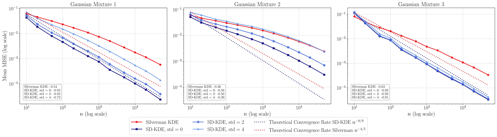

# SD-KDE: Score-Debiased Kernel Density Estimation

# About
This repository contains the code for the paper "Score-Debiased Kernel Density Estimation".

## Requirements
- Python 3.9
- NumPy 1.20
- Matplotlib 3.3
- Scipy 1.7

## Installation
You can set up the environment using conda:
```
conda create -n sd-kde numpy scipy matplotlib
```

## Experiments

### Gaussian Mixture 1D Experiments
To generate Figure 2, Figure 3, Figure 4, and Figure 8, run the following command:
```
python shrinkage_kde_gaussian.py --n_seeds 50 --n_list '10,20,50,100,200,500,1000,2000,5000,10000,20000,50000' --plot_empirical
```
This command will take several hours. You can speed it up significantly by using a smaller number of samples in n_list.
### Laplace Mixture 1D Experiments
To generate Figures 9, Figure 10, Figure 11, run the following command:
```
python shrinkage_kde_laplace.py --n_seeds 50 --n_list '10,20,50,100,200,500,1000,2000,5000,10000'
```
### Score Visualization
To generate Figure 11 and Figure 12, run the following command:
```
python visualize_score.py
```
### Diffusion Model Experiments
The details for the diffusion model experiments are the [Diffusion README](./minDiffusion/README.md).


